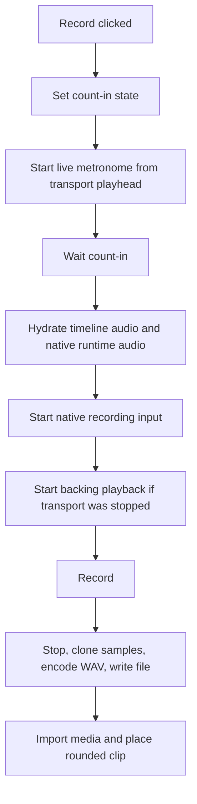
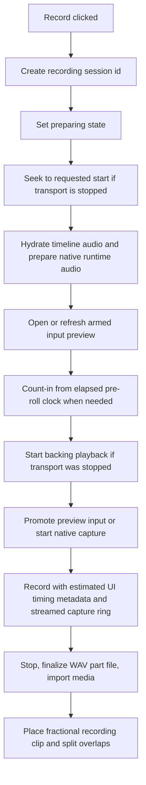

# Pocket DAW Recording Hardening Audit

Date: 2026-06-20
Baseline: Pocket DAW 0.6.19
Scope: bounded first repair pass for installed-app mono live-audio recording.

## Confirmed Root Causes

1. Fractional recording placement was lost in `apps/pocket-daw/src/daw/audioClips.ts`.
   `placeAudioClipOnTrack` rounded every `startBar` with `Math.round`, so takes requested at bars such as `1.25`, `2.5`, or `7.75` were placed on whole bars.

2. Same-track overwrite splitting already used arithmetic that can preserve fractional clip boundaries, but it received rounded recording starts. Once the placement start is preserved, the right-hand preserved clip receives the correct `sourceOffsetSeconds`.

3. Stopped-transport recording did expensive work after count-in. Timeline audio hydration and native runtime audio-cache preparation could run after pre-roll, making the capture boundary variable.

4. Stopped-transport recording started native capture before backing playback. Native playback startup time could therefore become leading silence in the captured take.

5. Armed input preview and recording capture were separate native lifecycles. Starting a recording while preview was active destroyed the existing input stream and rebuilt it at the boundary.

6. The stopped-transport count-in metronome used a transport position derived from a non-advancing playhead. That could repeatedly schedule from the same transport time rather than from elapsed count-in time.

7. `startBar` and `sampleRate` cross the TypeScript/Rust recording bridge as descriptive/request fields, not native timing anchors. This pass now preserves them in status/stop diagnostics as request context; Rust still does not use them for capture timing or resampling.

8. Native playback, native recording, and UI status use different clocks:
   - browser `performance.now()` for UI estimates,
   - Rust `Instant` for recording elapsed time,
   - CPAL input callback frames for capture storage,
   - native playback rendered frame count for playback status.

9. Before the monitor-ring slice, recording and monitoring shared a mutex-backed buffer and the monitor output callback locked once per output frame.

10. Input and output streams still use independent default device configs. Monitoring now applies explicit input-to-output sample-rate pacing in the output callback; recorded WAV capture still uses the native input sample rate.

11. Before the writer-thread slices, stop/finalize cloned the recorded sample vector, encoded a complete WAV byte vector, and wrote synchronously.

12. Native CPAL stream errors were mostly printed. This pass now stores recording and monitor stream errors in shared recording state so the UI can surface them through `native_recording_status`.

## Implemented First-Pass Changes

- Preserved finite fractional audio clip `startBar` values to three decimals in `placeAudioClipOnTrack`.
- Kept snapping responsibility in UI commands and timeline gestures instead of the low-level media placement helper.
- Added tests for recording placement at bars `1.25`, `2.5`, and `7.75`.
- Added a fractional overwrite regression test that verifies left/right split boundaries and right-hand `sourceOffsetSeconds`.
- Added a `preparing` recording state and optional immutable `sessionId`.
- Added `recordingSessionMatches` guards so late async preparation, start, stop, load, or decode results cannot mutate an obsolete recording session.
- Added explicit recording startup orchestration tests for stopped transport, already-playing transport, count-in order, stale cancellation, input-preview-before-capture, and start-failure cleanup decisions.
- Moved timeline audio hydration and native runtime audio-cache preparation before count-in.
- Opened or refreshed armed input preview before count-in so the input stream is warm where native preview is available.
- Changed stopped-transport startup order so backing playback starts before native capture.
- Added estimated timing metadata to recorded media items:
  - `requestedStartBar`
  - `placementStartBar`
  - `captureStartTransportSeconds`
  - `playbackStartedAtMonotonicMs`
  - `captureRequestedAtMonotonicMs`
  - `timingSource`
  - `recordingBackend`
- Added a native preview-to-recording promotion path that clears buffers and enables capture on the already-running preview input stream when track/session identity matches.
- Added shared native recording error propagation for input and monitor stream errors.
- Replaced repeated idle/error recording-state literals with small helpers.
- Removed the duplicate `stopActiveAudioSources` call in `AudioEngine.stop`.
- Fixed existing native clippy blockers so the Windows native gate can run with `-D warnings`.
- Added a Windows CI job for Pocket DAW frontend/native checks and added family parity to the core CI step.

## Implemented Native Telemetry Slice

This follow-up slice starts the native recording session rewrite without changing file writing, latency compensation, or playback/capture clock ownership.

- Added native input callback frame counters:
  - `inputFrameCount`
  - `capturedFrameCount`
  - `captureStartInputFrame`
  - `firstInputFrame`
- Added monitor diagnostics:
  - `monitorBufferedFrameCount`
  - `monitorUnderrunCount`
  - `monitorOverrunCount`
- Added capture-drop telemetry as `droppedInputFrameCount`.
- Added `captureStartedAtUnixMs` as a native-side wall-clock diagnostic for capture start. It is not a sample clock and is not used for latency correction.
- Preserved preview-to-recording continuity: input frames observed during armed preview advance `inputFrameCount`, and preview promotion anchors capture at the prior input frame count instead of resetting the native stream timeline.
- Added the native telemetry fields to `NativeRecordingStatus`, `NativeRecordingStopResult`, the TypeScript bridge, browser fallback defaults, and saved media metadata as `native*` diagnostic keys.
- Added Rust tests for direct capture anchors, preview promotion anchors, monitor underrun/overrun counters, and status reporting.
- Added a TypeScript test for mapping native stop-result counters into media metadata.

## Implemented Writer-Thread Capture Slice

This slice replaced the transitional in-memory capture vector with a bounded writer path and streamed WAV finalization.

- Removed `RecordingShared.samples: Vec<f32>` from the capture path.
- Added a bounded native capture path from the CPAL input callback to the writer thread.
- Added a dedicated recording writer thread that writes PCM16 data to `<take>.wav.part`, patches the WAV header on stop, flushes/syncs, closes, and renames the part file to `<take>.wav`.
- `stopNativeRecording()` still resolves only after the final `.wav` exists, preserving the frontend import contract.
- On capture overflow, the input callback drops newest input samples, increments `droppedInputFrameCount`, and preserves the take's timeline start.
- On writer disconnect, the callback increments `droppedInputFrameCount` and surfaces a native recording warning.
- Native status now reports `sampleCount` from accepted writer frames rather than stored sample-vector length.
- Stop/finalize duration and file size now come from the writer summary rather than a cloned sample vector.
- Preview-to-recording promotion starts a writer, resets capture/drop counters, and preserves preview input-frame continuity.
- App stop messaging now includes a visible warning when `droppedInputFrameCount > 0`; the diagnostic metadata remains saved as `nativeDroppedInputFrameCount`.
- Added Rust tests for writer part-file finalization, bounded queue overflow, stop-result writer summary, preview promotion writer attachment, and no-writer retry safety.
- Added a TypeScript test for the visible dropped-frame completion warning.

The capture storage and full-buffer synchronous WAV write limitations are resolved; final recovery UX remains separate follow-up work.

## Implemented Monitor Ring And Atomic Status Slice

This slice removes the monitor/output callback from the shared recording mutex and moves recording diagnostics to audio-callback-safe atomics.

- Replaced the monitor `VecDeque<f32>` with a fixed-capacity single-producer/single-consumer `MonitorRing`.
- The input callback writes monitor samples into preallocated atomic slots and drops newest samples on overflow.
- The output callback pops monitor samples without taking the recording control mutex, returning silence and incrementing underruns when empty.
- Monitor pops advance the read index with compare-and-swap so command-side buffer clears cannot be overwritten by an in-flight output callback.
- Moved monitor settings, peak, input/capture/drop counters, monitor underrun/overrun counters, and capture frame anchors to atomics.
- Preview-to-recording promotion now resets capture counters and frame anchors before publishing `capture_enabled`; capture enable is the final atomic gate.
- Replaced callback-generated warning strings with an atomic warning code; status converts the code back into user-facing text outside the callback.
- Runtime status now reads an atomic snapshot rather than locking shared recording status.
- Kept stream handles, target paths, device names, and writer handle under normal command-side ownership.
- Added Rust tests for bounded SPSC ring order/overflow, monitor output independence from the writer-control mutex, atomic capture counters, monitor underrun/overrun accounting, preview-to-capture reset, and status snapshots.

## Implemented Capture Writer Ring Slice

This slice removes the remaining input-callback capture allocation and writer-sender lifecycle lock.

- Added a fixed-capacity single-producer/single-consumer `CaptureWriterRing` for the capture-to-writer path.
- The input callback writes accepted mono samples directly into preallocated atomic slots; it no longer allocates a `Vec<f32>` per callback and no longer clones or locks a writer sender.
- The writer thread drains the ring to the existing `.wav.part` file and finalizes the WAV exactly as before.
- The writer thread uses buffered file output so ring-drained samples do not become one operating-system write per PCM frame.
- Stop and cancel disable capture first, drop streams, wait for in-flight input callbacks to exit, then close or cancel the capture ring and join the writer.
- If input callbacks fail to drain within the bounded stop timeout, stop cancels the writer, clears the active runtime for retry, and returns an explicit error instead of closing the ring under a live callback.
- The input callback wakes the writer at most once per callback block after accepted samples, not once per sample.
- Overflow remains drop-newest and increments `droppedInputFrameCount`; the UI warning and saved diagnostic metadata stay unchanged.
- Added Rust tests for ring-backed writer finalization, ring-backed capture counters and frame anchors, ring overflow/drop warnings, preview-to-capture reset, stop-result writer summaries, and cancel wakeup.

This is still not a complete native clock rewrite. Capture is now callback-allocation-free for the writer path, but recording is still not sample-locked to native playback.

## Before Lifecycle



## After Lifecycle



## Clock And Timestamp Model

Current first-pass model:

- `placementStartBar` is the authoritative timeline placement chosen by the UI transport at record start.
- `captureStartTransportSeconds` is derived from `placementStartBar`, BPM, and time signature.
- `playbackStartedAtMonotonicMs` and `captureRequestedAtMonotonicMs` are browser monotonic estimates.
- Rust `elapsedSeconds` remains the native recording elapsed timer.
- Rust `captureStartedAtUnixMs` is a native wall-clock diagnostic, not a sample-accurate anchor.
- Rust `captureStartInputFrame` and `firstInputFrame` are zero-based CPAL input callback frame counters for the active input stream. They anchor capture-side timing only.
- Rust `recordingSessionId`, `requestedStartBar`, `requestedStartSeconds`, and `requestedSampleRate` now echo the TypeScript recording request. `captureSampleRate` records the actual CPAL input sample rate. These fields are diagnostic context, not correction inputs.
- Native playback capture/stop anchor metadata records the current native playback status snapshot: active/playing flags, playback position, rendered frame count, started generation, sample rate, channel count, and the UI monotonic timestamp when the snapshot was requested.
- No field added in this pass claims playback/capture sample-lock accuracy or applies latency compensation.

Required phase-two model:

- Native playback and native recording should share a session clock owned by Rust.
- The input callback should record the first accepted input frame index.
- The output callback should expose the rendered frame count used as the playback anchor.
- The recording result should return `firstInputFrame`, `captureSampleRate`, `playbackStartFrame`, `playbackSampleRate`, device latency estimates, and dropped-frame counters.
- UI timestamps should be labeled as presentation estimates only.

## Implemented Playback Anchor And Calibration Tooling Slice

This slice adds explicit measurement data for later latency work without silently shifting recorded clips.

- Recording startup captures a native playback snapshot immediately before requesting native capture.
- Recording stop captures a second native playback snapshot immediately before requesting native stop.
- Recorded media metadata now stores capture/stop playback anchor fields with `nativePlaybackCapture*` and `nativePlaybackStop*` prefixes.
- The metadata keeps playback rendered frame counts and sample rates separate from CPAL input frame counters.
- Native recording status and stop results now echo request/capture correlation fields: `recordingSessionId`, `requestedStartBar`, `requestedStartSeconds`, `requestedSampleRate`, and `captureSampleRate`.
- Recorded media metadata stores those fields as `nativeRecordingSessionId`, `nativeRequestedStartBar`, `nativeRequestedStartSeconds`, `nativeRequestedSampleRate`, and `nativeCaptureSampleRate`.
- Added a loopback calibration report helper that summarizes detected offsets across takes: min, median, p95, max, average, standard deviation, and aggregate dropped/underrun/overrun counters.
- The calibration helper explicitly reports `compensationApplied: false` and `appliedCompensationSeconds: 0`; no hidden timing offset is applied.

## Implemented Monitor Sample-Rate Conversion Slice

This slice fixes monitoring when the input and output devices report different default sample rates.

- `build_monitor_stream()` now creates a callback-local `MonitorResampler` from the capture input sample rate to the selected output device sample rate.
- The monitor output callbacks call `next_monitor_resampled_frame()` instead of consuming one input sample for every output frame.
- Higher output rates hold monitor input samples across the needed output frames instead of underrunning immediately.
- Lower output rates skip intermediate monitor input samples instead of playing monitoring slow.
- The conversion is scoped to input monitoring only. It does not resample recorded WAV data, move clip placement, modify capture counters, or apply latency compensation.
- Added Rust tests for same-rate passthrough, 4 Hz to 8 Hz pacing, 8 Hz to 4 Hz pacing, and 44.1 kHz to 48 kHz pacing without early underrun.

## Proposed Native Session Architecture

```text
RecordingSession
  id
  requestedStartBar
  requestedStartSeconds
  inputDevice
  outputDevice
  captureStream
  monitorStream
  playbackAnchor
  captureRing
  monitorRing
  writerThread
  statusCounters
```

Recommended rules:

- The armed track owns one input session.
- Preview and capture are states of that session: `previewing`, `armed-for-capture`, `capturing`, `finalizing`, `error`.
- Starting capture attaches a bounded writer ring, resets counters, records the native capture anchor, and flips the capture flag.
- Monitor output reads from a monitor ring without locking the capture buffer.
- File writing now runs on a dedicated thread and writes to a `.part` file before rename.
- Status reads never block the audio callback.

## Ring Buffer Design

Capture ring:

- Single producer: CPAL input callback.
- Single consumer: writer thread.
- Bounded capacity measured in mono samples.
- Overflow policy: drop newest samples, increment `droppedInputFrameCount`, surface the counter to diagnostics and post-stop UI.
- Capture callback currently does format conversion, peak update, monitor enqueue, direct capture-ring push, and counter updates without per-callback allocation.
- Capture status counters use atomics, and `capture_enabled` remains the final publication gate for preview-to-recording promotion.

Monitor ring:

- Implemented as a fixed-capacity SPSC ring.
- Single producer: CPAL input callback.
- Single consumer: CPAL output callback.
- Separate from the capture ring so monitor underruns cannot stall recording.
- Output callback uses callback-local sample-rate pacing before popping from the ring and never locks the recording control mutex.
- Maintains underrun and overrun counters with atomics.

## File-Writer Design

Implemented writer-thread target:

1. On capture start, open `project-media/recordings/<take>.wav.part`.
2. Write a placeholder WAV header.
3. Stream PCM samples from the bounded capture ring to the writer thread.
4. On stop, drain remaining samples, patch the header sizes, flush/sync, and close.
5. Rename `.wav.part` to `.wav`.
6. If interrupted, leave `.part` recovery as a documented follow-up.

Benefits:

- Stop time is bounded by remaining queued audio rather than encoding the full take from memory.
- Long recordings do not require cloning the entire sample vector.
- Interrupted takes can be detected in a future recovery pass.

## Calibration Design

Manual and future automated calibration should measure:

- record-button-to-capture delay,
- median alignment offset,
- p95 alignment offset,
- variance over ten loopback click takes,
- monitor underruns and overruns,
- stop/finalization duration,
- input/output sample-rate mismatch,
- reported device input and output latency where available.

Recommended calibration workflow:

1. Generate a click on playback at the requested start.
2. Loop output to input.
3. Record ten takes for each device/sample-rate pair.
4. Detect click onset in each recorded WAV.
5. Report median, p95, min, max, and standard deviation.
6. Store calibration as explicit user/device metadata, never as a hidden magic offset.

Implemented tooling:

- `buildLoopbackCalibrationReport()` summarizes measured loopback takes and requires ten valid offsets before flagging the data as ready for compensation review.
- The report ignores invalid offset measurements when aggregating counters, so failed detections do not skew dropped-frame or underrun totals.

## Migration And Compatibility

- Existing `.pocketdaw` projects remain compatible.
- Recorded WAV paths remain under `project-media/recordings/`.
- The take still enters the Media Pool and is placed on the armed audio track.
- Same-track overwrite behavior is preserved, now with fractional placement support.
- New recording metadata is non-destructive and optional.
- No `.pocketdaw` schema version bump was required.
- PCS1/schema-16 imports are untouched.

## Manual Windows Test Matrix

Run on an installed Tauri app, not browser preview.

| Scenario | Expected result | Measurements |
| --- | --- | --- |
| Stopped transport, count-in off | Backing playback begins before capture request, take placed at requested bar. | Record-button-to-capture delay, alignment offset. |
| Stopped transport, count-in on | Preparation completes before pre-roll, count-in advances while playhead is stopped. | Count-in click timing, alignment offset. |
| Already-playing transport | No backing playback restart, capture starts against current transport estimate. | Alignment offset and transport continuity. |
| Monitor off | Recording succeeds without monitor stream. | Capture delay, stop duration. |
| Monitor on | Recording succeeds and monitor status reports output device. | Underrun/overrun if available. |
| 44.1 kHz input, 48 kHz output | Recording succeeds and input monitoring remains paced without immediate underruns. | Drift over long take, monitor quality, underrun count. |
| 48 kHz input, 44.1 kHz output | Recording succeeds and input monitoring skips monitor samples rather than playing slow. | Drift over long take, monitor quality, underrun count. |
| Device disconnect during preview | UI surfaces native status error and returns to coherent state. | Error text, recovery path. |
| Device disconnect during recording | UI surfaces native status error; stop/finalize behavior is explicit. | Partial take handling, error text. |
| 10 repeated loopback click takes | Median/p95 alignment and variance are recorded. | Median, p95, min, max, standard deviation. |
| Long recording memory/finalization | Stop duration and memory behavior are recorded. | Stop/finalization duration. |
| Save/reopen playback | Recorded media survives save, close, reopen. | Reload success and playback confidence. |

## Remaining Risks

- Capture is still not sample-locked to native playback.
- JS-side monotonic timestamps are estimates.
- Playback anchor metadata is a native status snapshot, not a shared Rust playback/recording clock.
- Native request/capture correlation fields document what was requested and what CPAL used, but no compensation is applied from them yet.
- Monitoring now has explicit input-to-output sample-rate pacing, but not high-quality band-limited resampling or reported device latency compensation.
- Native stop/finalize no longer clones the full recorded take or builds a complete WAV byte vector.
- If the bounded capture ring is full, the WAV preserves the beginning of the take and drops later input samples. The UI reports a post-stop warning and records `nativeDroppedInputFrameCount` metadata.
- Stream error propagation improved, but there is no recovery state machine yet.
- Device latency is not reported by the OS backend or compensated.
- There is no `.part` recovery UI for interrupted takes.
- `droppedInputFrameCount` now reports bounded capture-ring overflow and writer-stopped drops.

## Recommended PR Sequence

1. Land the first-pass placement/startup/session hardening and docs.
2. Add native recording status counters: underruns, overruns, dropped input frames, first input frame. Completed by the native telemetry slice.
3. Add native dropped-input-frame accounting and user-visible warnings. Completed by the native telemetry and writer-thread slices.
4. Move WAV writing to a bounded writer queue/thread with `.part` finalize. Completed by the writer-thread capture slice.
5. Replace monitor queue and shared status mutexes with atomics or lock-free SPSC structures. Completed by the monitor ring and atomic status slice.
6. Remove remaining input-callback allocation and lifecycle writer-sender lock attempt. Completed by the capture writer ring slice.
7. Add native playback/capture session anchors and loopback calibration tooling. Completed by the playback-anchor, native request-correlation, and calibration tooling slice.
8. Add explicit sample-rate conversion for monitoring. Completed by the monitor sample-rate conversion slice.
9. Add `.wav.part` recovery UI for interrupted takes.
10. Add opt-in calibrated latency compensation after enough measurement evidence exists.
